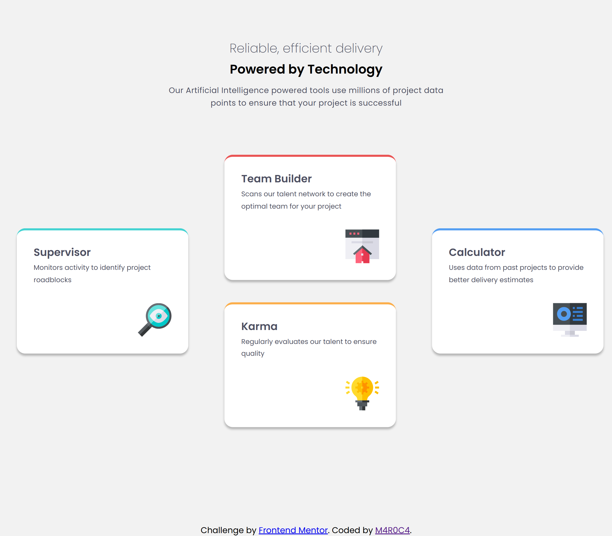
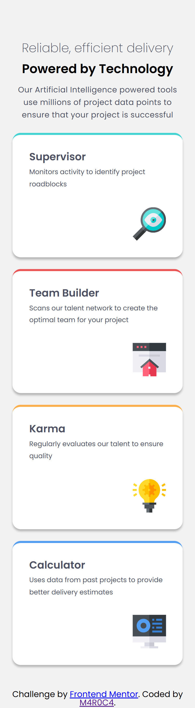
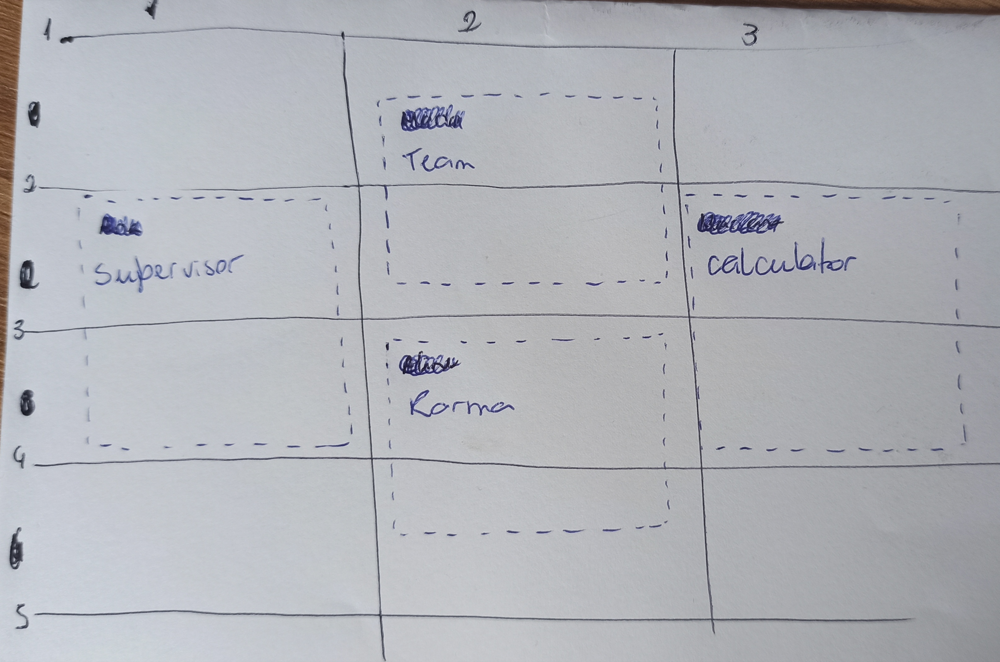

# Frontend Mentor - Four card feature section solution

This is a solution to the [Four card feature section challenge on Frontend Mentor](https://www.frontendmentor.io/challenges/four-card-feature-section-weK1eFYK). Frontend Mentor challenges help you improve your coding skills by building realistic projects. 

## Table of contents

- [Overview](#overview)
  - [The challenge](#the-challenge)
  - [Screenshot](#screenshot)
  - [Links](#links)
- [My process](#my-process)
  - [Built with](#built-with)
  - [What I learned](#what-i-learned)
- [Author](#author)
- [Acknowledgments](#acknowledgments)

**Note: Delete this note and update the table of contents based on what sections you keep.**

## Overview

### The challenge

Users should be able to:

- View the optimal layout for the site depending on their device's screen size

### Screenshot





### Links

- Solution URL: [four-card-feature-section-master on GitHub](https://github.com/M4R0C4/four-card-feature-section-master)
- Live Site URL: [four-card-feature-section-master on VERCEL](https://four-card-feature-section-master-2yhtif57y.vercel.app/)

## My process

I started with mobile-first, coding the style using predetermined variables. After the mobile-first style, I moved on to the desktop layout. I tried using Flexbox, but without success I switched to Grid Layout, which provided a great answer.

### Built with

- Semantic HTML5 markup
- CSS custom properties
- Flexbox
- CSS Grid
- Mobile-first workflow

### What I learned

```html
<h1>Some HTML code I'm proud of</h1>
<p>Use Grid Layout on Media Query on Mobile-First</p>
```
```css
@media screen and (min-width: 641px) {
  body {
    display: flex;
    flex-direction: column;
  }
  .header__subtitle{
    margin-bottom: 1rem;
  }
  .header__text{
    margin-bottom: 4rem;
    width: 540px;
  }
  .cards {
    display: grid;
    grid-template-columns: 1fr 1fr 1fr;
    grid-template-rows: 1fr 1fr 1fr 1fr 1fr;
    gap: 20px;
  }
  .cards-colors {
    flex: 1 1 10px;
  }
  .supervisor {
    grid-column: 1;
    grid-row: 2/4;
  }
  .team {
    grid-column: 2;
    grid-row: 1/3;
  }
  .karma {
    grid-column: 2;
    grid-row: 3/5;
  }
  .calculator {
    grid-column: 3;
    grid-row: 2/4;
  }
}
```


## Author

- Website - [Mariana Candido - M4R0C4](https://github.com/M4R0C4)
- Frontend Mentor - [@M4R0C4](https://www.frontendmentor.io/profile/M4R0C4)
- LinkedIn - [Mariana Candido](https://www.linkedin.com/in/mariana-candido-20b59b88/)

## Acknowledgments

It was a little difficult to deal with the Grid Layout at first. Mainly placing the cards in the appropriate positions. But it was overcome when I decided to make a drawing with the cards and the divisions of the rows and columns.


